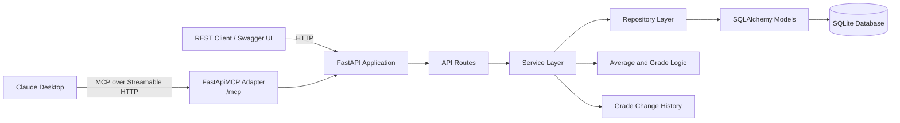
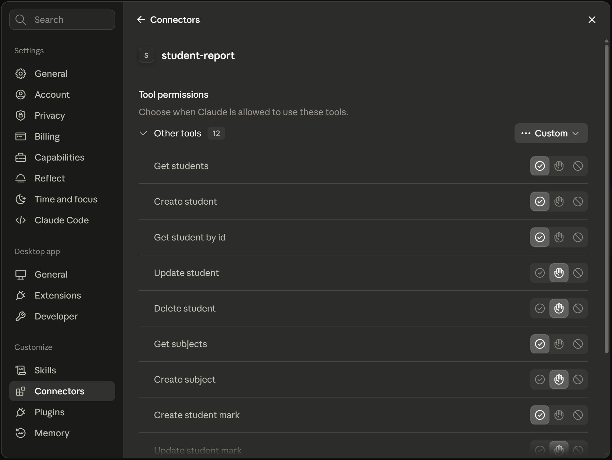
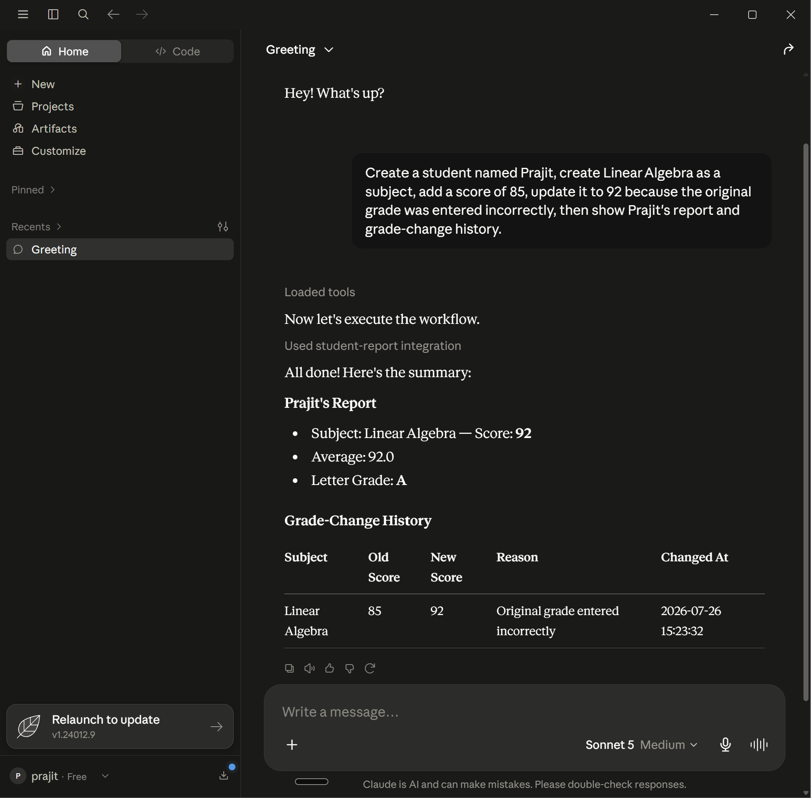
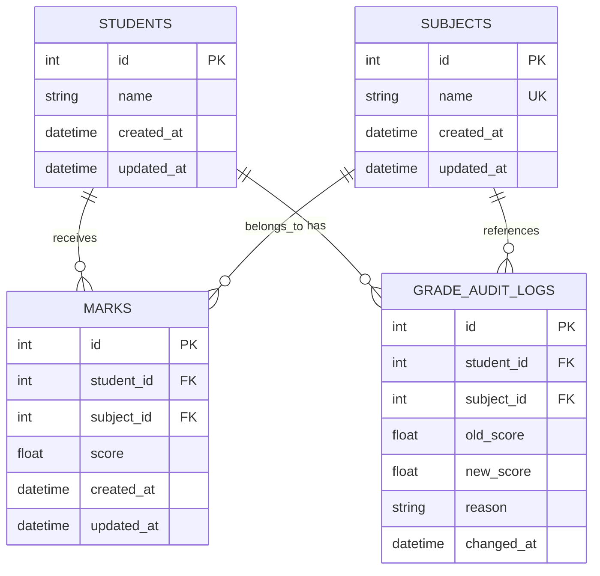
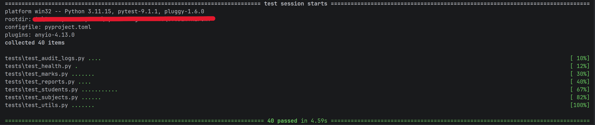

# Student Records API

I originally built this project as a small terminal program that stored student records in a JSON file. I later rebuilt it as a FastAPI backend using SQLite and SQLAlchemy, then added an MCP endpoint so Claude Desktop could use the same API operations as tools.

There are two ways to use the project:

- through normal REST API requests using Swagger UI
- through Claude Desktop using Model Context Protocol (MCP).

Both options use the same backend and the same database.

**TECH STACK:** Python, FastAPI, SQLAlchemy, SQLite, Alembic, Pytest, Pydantic, and FastApiMCP

---

## What the Project Does

The project lets you:

- create, view, update and delete students
- create and view subjects
- add and update student marks
- generate a report with an average and letter grade
- keep a history when a mark is changed
- allow Claude Desktop to use the API through MCP tools.

Right now, the project has **12 REST endpoints** and **40 passing tests across 7 test files**.

---

## Two Ways to Use the Backend

### 1. REST API

The REST API can be tested through FastAPI's built-in Swagger UI:

```text
http://127.0.0.1:8000/docs
```

Swagger UI shows every endpoint and lets you send requests from the browser without needing a separate frontend.

### 2. Claude Desktop through MCP

The application also has an MCP endpoint at:

```text
http://127.0.0.1:8000/mcp
```

Claude Desktop can connect to this endpoint and use the API endpoints as tools.

Claude Desktop does not connect straight to the SQLite database. It uses the MCP tools, which go through the same FastAPI code as normal REST requests.

---

## Architecture

The REST API and Claude Desktop both use the same backend.



The main flow is:

```text
REST client or Claude Desktop
        ↓
FastAPI route
        ↓
Service
        ↓
Repository
        ↓
SQLite database
```

I separated the project this way so that the API routes would not contain all of the database and report logic.

---

## Claude Desktop and MCP

One of the latest additions to this version was connecting the backend to Claude Desktop through MCP.

Claude can discover the FastAPI operations as tools and use them to complete student-record tasks.

### Tool Discovery



*Claude Desktop discovering the FastAPI operations as MCP tools.*

### Example Claude Workflow



*Claude Desktop using MCP tools to update student data and retrieve a report.*

---

## Database Design

The database uses four tables:

- `students` stores student information;
- `subjects` stores subject names;
- `marks` connects a student to a subject and stores the current score;
- `grade_audit_logs` stores previous mark changes.



A subject name must be unique.

The `marks` table also prevents the same student from having more than one current mark for the same subject.

When a mark is updated, the current score changes and a separate audit-log entry saves the old score, new score, reason, and time of the change.

---

## API Endpoints

| Area | Method | Endpoint | What it does |
|---|---|---|---|
| Health | `GET` | `/` | Checks whether the API is running |
| Students | `POST` | `/students/` | Creates a student |
| Students | `GET` | `/students/` | Returns all students |
| Students | `GET` | `/students/{student_id}` | Returns one student |
| Students | `PUT` | `/students/{student_id}` | Updates a student |
| Students | `DELETE` | `/students/{student_id}` | Deletes a student |
| Subjects | `POST` | `/subjects/` | Creates a subject |
| Subjects | `GET` | `/subjects/` | Returns all subjects |
| Marks | `POST` | `/students/{student_id}/marks` | Adds a mark |
| Marks | `PUT` | `/students/{student_id}/marks/{subject_id}` | Updates a mark |
| Reports | `GET` | `/students/{student_id}/report` | Generates a student report |
| Audit logs | `GET` | `/students/{student_id}/audit-log` | Returns the student's mark-change history |

The full request and response formats can be viewed in Swagger UI at `/docs`.

---

## Example Workflow

The easiest way to try the project is through Swagger UI.

After starting the server, open:

```text
http://127.0.0.1:8000/docs
```

Then complete the following steps:

### 1. Create a student

Open:

```text
POST /students/
```

Select **Try it out**, enter a student name, and run the request.

Example body:

```json
{
  "name": "Prajit"
}
```

Save the returned student ID.

### 2. Create a subject

Open:

```text
POST /subjects/
```

Example body:

```json
{
  "name": "Mathematics"
}
```

Save the returned subject ID.

### 3. Add a mark

Open:

```text
POST /students/{student_id}/marks
```

Enter the student ID in the path field.

Example body:

```json
{
  "subject_id": 1,
  "score": 85
}
```

### 4. Update the mark

Open:

```text
PUT /students/{student_id}/marks/{subject_id}
```

Enter the student and subject IDs.

Example body:

```json
{
  "score": 99,
  "reason": "Remark results"
}
```

### 5. View the report

Open:

```text
GET /students/{student_id}/report
```

The response includes the student's marks, average and letter grade.

### 6. View the change history

Open:

```text
GET /students/{student_id}/audit-log
```

The response shows the old score, new score, reason and time of the update.

The same workflow can also be completed by asking Claude Desktop to use the MCP tools.

---

## Testing

The project has **40 passing tests across 7 pytest files**.

The tests cover areas such as:

- student CRUD operations
- subject operations
- adding and updating marks
- report calculations
- audit logs
- invalid requests and missing records
- database isolation between tests

Run the test suite with:

```bash
python -m pytest -v
```

For API tests, FastAPI's dependency override system replaces the normal database session with a temporary SQLite database.

This lets the tests use the real routes, services, repositories and SQLAlchemy models without changing the development database.

### Test Screenshot


<details>
<summary>View test result</summary>



*The complete pytest suite passing.*

</details>

---

## Running the Project Locally

### Requirements

- Python 3.10 or newer
- Git

### 1. Clone the repository

```bash
git clone https://github.com/praj1t/Student-Records-API.git
cd Student-Records-API
```

### 2. Create a virtual environment

#### Windows PowerShell

```powershell
python -m venv .venv
.venv\Scripts\Activate.ps1
```

#### macOS or Linux

```bash
python3 -m venv .venv
source .venv/bin/activate
```

### 3. Install the dependencies

```bash
python -m pip install --upgrade pip
python -m pip install -r requirements.txt
```

### 4. Run the database migrations

```bash
alembic upgrade head
```

### 5. Start the server

```bash
uvicorn app.main:app --reload
```

### 6. Open the project

| Page | Address |
|---|---|
| Health check | `http://127.0.0.1:8000/` |
| Swagger UI | `http://127.0.0.1:8000/docs` |
| OpenAPI schema | `http://127.0.0.1:8000/openapi.json` |
| MCP endpoint | `http://127.0.0.1:8000/mcp` |

Keep the server running while using Swagger UI or Claude Desktop.

---

## Why I Built It This Way

### 1. Keeping routes small

The route files mainly receive requests and return responses. The service and repository files handle the project logic and database work.

This keeps `main.py` and the route files from becoming one large file.

### 2. Using separate subject and mark tables

Subjects are stored once and can be shared by multiple students.

The `marks` table stores which student received which score in which subject.

### 3. Saving mark changes

Instead of completely losing the previous value when a mark changes, the project creates an audit-log record.
This makes it possible to see what changed and why.

### 4. Testing the real API

Most API tests use FastAPI's `TestClient` instead of calling the database code directly.
This checks the API in a way that is closer to how someone would actually use it.

### 5. Reusing the same backend for MCP

I did not build a second set of student-record logic for Claude Desktop.
The MCP tools reuse the same FastAPI endpoints and project logic as the REST API.

---

## Project Versions

### V1 — Terminal Program

The first version was a command-line Python program. It used `input()` for user interaction and stored student data in a JSON file.

### V2 — FastAPI Version

The second version moved the program behind REST endpoints.
It added request validation, error handling, CRUD operations, and automated tests.

### V3 — Relational Backend and MCP

The current version replaced the JSON file with SQLite and SQLAlchemy.

It also added:

- separate tables for students, subjects, marks, and audit logs
- Alembic migrations
- service and repository files
- student reports
- grade-change audit logs
- isolated database tests
- an MCP endpoint for Claude Desktop

The main goal was to take a small beginner project and improve it step by step into a proper backend application.

---

## What I Learned

Through this project, I practiced:

- building and organizing a FastAPI backend
- creating REST endpoints
- using Pydantic models for request validation
- creating relationships and rules between SQLAlchemy tables
- managing database changes with Alembic
- splitting the project into routes, services, and repositories
- testing API behavior with Pytest and `TestClient`
- using a separate temporary database during tests
- turning the API endpoints into MCP tools
- connecting a backend project to Claude Desktop
